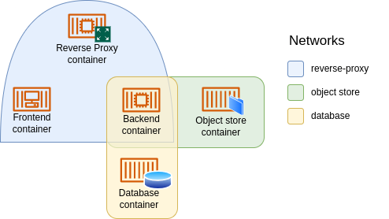

# Application architecture

This section presents the most common architecture/infrastructure patterns used in self-hosted applications, and the general configuration that'll be used to cover the expected use cases.

## Common services
Applications and services usually need 3rd party services in order to work. For example, web applications make use of Relational Database Management Systems (RDBMs), maybe key-value stores like [Redis](https://redis.io/) or object stores like [MinIO](https://min.io/), and require a reverse proxy in production.

Docker and Compose make the creation of these 3rd party services incredibly simple and lightweight. In my own machine there is a differet instance of each service required for each project I'm developing or testing. Currently that means 17 instances of [Postgres](https://www.postgresql.org/), 7 of Redis, 2 of MinIO, among others. These services can be turn on and off at will, and everything runs smoothly in a 3rd gen Ryzen 5 with 8 gigs of RAM (Linux, of course).

When it comes to production though, many different considerations arise. For the kind of services relevant to our case, these are the main two:

 - Make the best effort to ensure data will not be lost in case of a hardware/software failure. If developers' hard drives fail, data stored by the services instantiated in their computers will be gone.
 - Allow for easy access to the services from the internet. In development people can assign different ports to different instances of services, and make sure that services running concurrently will not use the same port. In production there will be many services accessed from outside the cluster via the same ports (mostly 80 and 443).

## Persistent data
Running [highly-available](https://www.digitalocean.com/community/tutorials/what-is-high-availability) services that store persistent data is not an easy task. Let's consider for example a RDBM system like Postgres. One would like to have a scalable and fault-tolerant system such that if a database server fails the system can continue working. This is a very hard problem indeed, and falls way beyond our scope. I'd go as far as saying that mounting such a cluster is harder than mounting the entire setup presented here. If you want to read more about the topic I'd recommend to have a look at [Pgpool II](https://www.pgpool.net/docs/latest/en/html/intro-whatis.html). 

And Postgres is just one example. The same happens [with MinIO](https://docs.min.io/docs/distributed-minio-quickstart-guide.html) and [with Redis](https://docs.redis.com/latest/rs/concepts/high-availability/clustering/). High-availability solutions that store persistent data are usually enterprise-grade territory behind paywalls, and the best way to go today is to just hire a managed service like [Amazon RDS](https://aws.amazon.com/rds/) for databases like Postgres, [Google Memorystore](https://cloud.google.com/memorystore/docs/redis/) for memory stores like Redis, and [DigitalOcean Spaces](https://docs.digitalocean.com/products/spaces/resources/) for object stores like MinIO. But hey, this is a self-hosted adventure🚀!

**NAS - Raid - Backups**. In the end I decided to run these services using a semi-centralized architecture. The idea is the following: I'll just run a single instance of each of these services inside my cluster, but that instance will store data via NFS in my NAS which is regularly backed up and runs RAID arrays.

**Pros:**
 - If the machine running the service fails, another machine will take over and connect to the same NFS volume, thus making the service available again. This is very fast and should result in sub-5 seconds service outages.
 - All data will be stored in a backed up [RAID 10 array](https://en.wikipedia.org/wiki/Nested_RAID_levels), which gives good performance and some data protection.
 - Data should still be recoverable from the backups and/or NAS disks after catastrophic failures.
 - The NAS is working mostly as an NFS server, I could mount the database service directly in the NAS, but this would add more tasks to its underpowered hardware.

**Cons:**
 - The NAS is a single point of failure.
 - All services are storing stuff to the same RAID array concurrently, which will probably impact performance. Having different arrays for the different services would definitely be a good idea. But enough spending.

A question that often arises is: why not replicating the service with many containers mounting the same volume at the same time? This is usually a very bad idea. When multiple machines write to the same shared volume, locking problems can quickly lead to data corruption. Not to mention that the application needs to take into account that it is replicated so different replicas do not perform the same task twice.

 If only one machine is writing and the rest are only reading (similar to a primary-replica setup for databases) there are cases where shared mounting is be a good idea. [Here](https://www.digitalocean.com/community/tutorials/how-to-share-data-between-docker-containers) you can find more information about this. Oh, and if you are developing an application that will run as a service, please don't rely on the computer's filesystem. Use an object store to you make the application scalable.

## Reverse Proxy
Apart from persistent storage, our applications need to be accessible from the internet. Mostly through a browser using ports 443 and 80 (to redirect to 443). And not only this, we want to have a good URL for that. Let's assume we'll use the service `swarmadventures.com`. When hosting a service such as [Valutwarden](https://github.com/dani-garcia/vaultwarden), it'd be nice to access it via `vaultwarden.swarmadventures.com`, and the same with any service.

To achieve this we'll need quite a smart reverse proxy. In particular, if a request arrives at `service.swarmadventures.com` it will need to first map the request to the corresponding service, and then redirect it to a machine running the service (and to the port in which it is running). Moreover, we expect the load of the machines to be balanced, so the reverse proxy also has to act as a load balancer. And if that was not enough, we'll ask the reverse proxy to go get some awesome certificates from [Let's Encrypt](https://letsencrypt.org/) so that users connect securely via HTTPS.

Naturally, this reverse proxy is a centralized service. At least it needs to store the certificates, and we do not want two instances fetching certificates for the same domain or writing to disk at the same time (remember the locking problem from persistent storage?). I decided then to proceed in the same way: let's run just one instance of the reverse proxy in the cluster and store certificates in the NAS. We have the same pros and cons discussed above, except for the performance hit.

The specific reverse proxy used will be discussed in the [Central services](./services) section. A spolier? It's not [Traefik](https://traefik.io/).

## Overlay Networks
Now that we have discussed our architecture we need to connect everything together. For security reasons (although some will say paranoid reasons) we do not want unnecessary connections. For example the reverse proxy should not be able to connect to the database server, and an application that does not need an object store should not be able to access MinIO. Enter [Overlay Networks](https://docs.docker.com/network/overlay/).

Overlay networks allow containers running in different nodes to connect. For example, if one container needs a connection to the container running the database service, which is running on a different node, both will have to be connected to a common overlay network.

The strategy will be to create one overlay network for each centralized service (database, object store, memory store and reverse proxy).

As an example, let us assume we have one container for each of Postgres, MinIO and a reverse proxy. Then we'll have three overlay networks called `database`, `object-store` and `reverse-proxy`, respectively. Now we want to mount service composed by:

 - A backend that needs connetion to a database and an object store.
 - A frontend that needs to connect to the backend and the reverse proxy.

Then, the conceptual map would look as follows:

One thing to take into account here is that all applications using the database will form part of the same network. Real paranoids would further isolate different services, but I don't want to create too many networks in my cluster.
