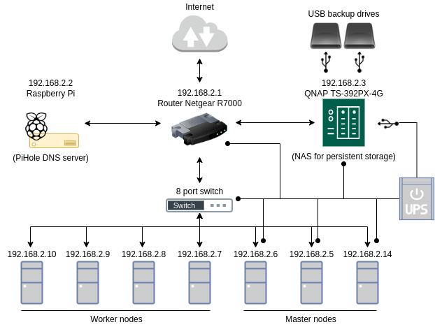

# Introduction

When you think about creating a self-hosted cluster of computers you wonder what are the best tools available. We engineers/developers know that there is no silver bullet, but in current times almost everyone working with technology will agree that human time is far more expensive than computer time. I follow the principle of searching for the tools that simplify your life as much as possible while satisfying your needs, and moving on to more complex setups when you have further needs or cost constraints.

Docker is one of those tools that simplify your life. In a big way.

From docker.com: *Docker takes away repetitive, mundane configuration tasks and is used throughout the development lifecycle for fast, easy and portable application development - desktop and cloud. Docker’s comprehensive end to end platform includes UIs, CLIs, APIs and security that are engineered to work together across the entire application delivery lifecycle.*

As such, Docker has completely taken over the self-hosted spectrum. Developers pack their applications into [Containers](https://www.docker.com/resources/what-container) that can then be deployed to basically any hardware in a few simple steps.

Now, when you want to deploy applications to a cluster of computers, problems like hardware allocation, scalability, storage provisioning, network configuration, among others, quickly become painful. But if you deploy your applications using containers you can simplify your life by using a [Container Orchestrator](https://devopscube.com/docker-container-clustering-tools/).

Container orchestrators automate many of the usual DevOps tasks by presenting your cluster as a unified hardware structure. [Docker Swarm](https://docs.docker.com/engine/swarm/), [Kubernetes](https://kubernetes.io/), [Mesos](https://mesos.apache.org/), [Rancher](https://rancher.com/docs/) and [Nomad](https://www.nomadproject.io/) are some of the most used orchestrators. And if you start reading you'll find that each of them is a universe on its own.

## Why Swarm?
I'll be honest: this is not a completely informed decision and I only have two arguments.
1. In the past I've deployed applications with Kubernetes, the most popular container orchestrator. It is a powerfull and extensible tool that allows for customizable deploys, but at the expense of a steep learning curve with Kubernetes-only concepts and ad-hoc file formats.
2. To deploy services in Docker Swarm you use [compose files](https://docs.docker.com/compose/compose-file/compose-file-v3/), the configuration language used by [Docker Compose](https://docs.docker.com/compose/). I use Docker Compose everyday to develop and find incredibly useful and simple.

I have not used other orchestration tools, but after reading many blogs and comparisons I went on with Swarm. At least I can compare it against Kubernetes. And trust me, I do not regret my decision. I hope you see the beauty of Docker Swarm too after reading on this repo.

## Cluster infrastructure

Let's dive into the hardware setup. I'll just use a diagram for simplicity.

Who has so many machines at home, right? Well, I'm the wired guy asking for every dismissed computer out there, probably like many self-hosting enthusiasts.

So let me explain some of the infrastructure by means of Q&A.

- What's that [Raspberry Pi](https://www.raspberrypi.org/) doing there? TBH I'm not really sure. I could deploy [PiHole](https://pi-hole.net/) directly in the cluster but I had it already running.
 - Why 7 computers? It's what I have. From an [Athlon 64 X2](https://en.wikipedia.org/wiki/Athlon_64_X2) to an i7 11700k.
 - Why 3 master nodes? Because master nodes in Swarm use the [Raft](https://raft.github.io/) algorithm for consensus, and thus having 1 or 2 master nodes would mean that if any of them fail the cluster would no longer be fully operational. With 3 the cluster is tolerant to 1 faulty manager. To increase this number to 2 I'd need to have 5 manager nodes, but 5 managers and 2 workers sounds too much like my current job (as of February 2022, don't tell my boss).
- Why a NAS? You want your data to somehow be on the safe side. I've managed [RAID arrays](https://en.wikipedia.org/wiki/RAID) with [mdadm](https://linux.die.net/man/8/mdadm) before and it's rather painfull. I also tried to use a 3-replica [GlusterFS](https://www.gluster.org/) drive via [this Docker plugin](https://github.com/marcelo-ochoa/docker-volume-plugins) but met performance and stability issues. Finally I went with a NAS to store my persistent data in managed RAID arrays over NFS. After many nights fighting storage I gave up to the easy solution.
- Why USB drives? Just an easy and cheap way to have regular backups in case something goes wrong with the NAS.

On to the [Application architecture](./architecture.md).
