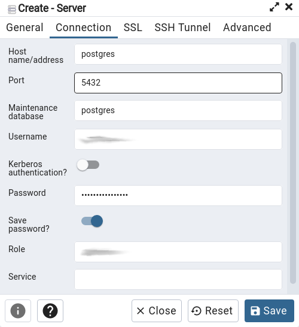
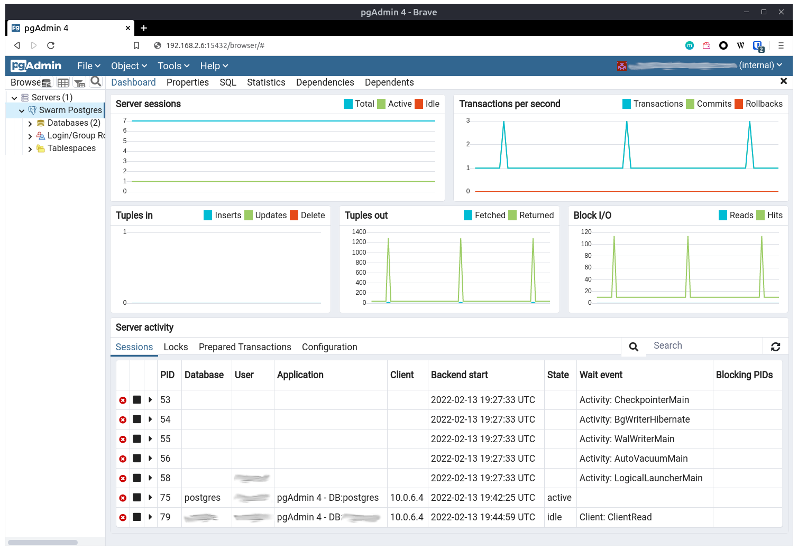

## Central services

As discussed in the [Application architecture section](./sections/architecture.md), the plan is to initially provide centralized services to be shared among hosted applications. We will host an RDBM, an object store and a reverse proxy. For now I'll leave out a memory store because the applications I want to host (and make use of a memory store) only use it as cache, so no need to persist the data.

## Database
After many experiences with RDBMSs I have settled with [PostgreSQL](https://www.postgresql.org/) (Postgres from now on). It is not only superior in most relational benchmarks, but it is also open-source and has a [great community](https://www.postgresql.org/community/) all around. I'm not going to discuss this point because it is a very wide topic and there is already a huge amount of information to read out there. I'll just say that going with MariaDB would be fine as well.

To mount the centralized database server (and most things really) I use a [compose file](https://docs.docker.com/compose/compose-file/). This file defines one or more services that run within the cluster, plus many properties of the services such as environment variables, ports to expose, volumes to mount, etc. Apart from Postgres itself I mounted [pgAdmin](https://www.pgadmin.org/), an interface to manage databases, permissions, etc. within the Postgres server. Although the entire compose file might look like a lot, I'll go over it bit by bit. 

```yaml
1  version: "3.8"
2  
3  services:
4    postgres:
5      image: postgres:alpine
6      networks:
7        - database
8      environment:
9        POSTGRES_PASSWORD_FILE: /run/secrets/postgres_password
10       POSTGRES_USER_FILE: /run/secrets/postgres_superuser
11     secrets:
12       - postgres_password
13       - postgres_superuser
14     volumes:
15       - postgres:/var/lib/postgresql/data
```
Line 1 declares the [specification version](https://docs.docker.com/compose/compose-file/compose-file-v3/) of the compose file. Line 3 states that the services will be defined next. In line 4 the service `postgres` is defined. So far so good.

Now let's see what is specified within the `postgres` service.

 - Line 5 specifies that the service will run the [Postgres image](https://hub.docker.com/_/postgres/) tagged `apline`. Images are downloaded automatically from the [Docker Hub](https://hub.docker.com/).
 - Lines 6 and 7 state that this service will be connected to the overlay network called `database`, as discussed in the [Overlay networks section](./sections/architecture.md#overlay-networks).
 - Lines 8 to 10 define the environment variables that will be passed to the container running the service. These variables indicate that the content of the file `/run/secrets/postgres_password` will be used as Postgres' admin password, and the same for the username. It is important to mention here that these values could be passed directly as environment variables by removing `_FILE`. However, the practice of using environment variables for secrets is [no longer considered a goo practice](https://techbeacon.com/app-dev-testing/how-keep-your-container-secrets-secure). It is recommended that you mount your secrets to a temporary file system ([tmpfs](https://www.kernel.org/doc/html/latest/filesystems/tmpfs.html)) using [Docker Secrets](https://docs.docker.com/engine/swarm/secrets/).
 - Finally, lines 11 and 12 indicate that when the container is running, the directory `/var/lib/postgresql/data` will be mapped to the [volume](https://docs.docker.com/storage/volumes/) called `postgres`.

We continue with the `pgadmin` service.

```yaml
16  pgadmin:
17   image: dpage/pgadmin4
18   networks:
19     - database
20   environment:
21     - PGADMIN_DEFAULT_EMAIL
22     - PGADMIN_DEFAULT_PASSWORD
23   ports:
24     - 15432:80
25   volumes:
26     - pgadmin:/var/lib/pgadmin
```

Ok so this is pretty similar to what we had before. There are only two main differences:

 - The `pgadmin` service does not define secrets. This is because the image implements the *old way* of managing secrets, directly via environment variables. If you deploy an application managing secrets as configuration please allow for the `_FILE` version of environment variables.
 - There is a `ports` directive. If I was using Docker Compose, this would map port 15432 of my computer to port 80 of the container. Pgadmin serves its web interface under port 80, so you could access it via `localhost:15432`. Under Docker Swarm, however, this directives indicates that port 15432 *of the cluster* will be mapped to port 80 *of the service*. There's a lot going on here, but using the amazing [ingress routing mesh](https://docs.docker.com/engine/swarm/ingress/) Swarm will **any** node of the cluster to route requests to port `15432` of a container running the `pgadmin` service. Pretty cool huh 🤓?. Anyways, this directive is to be removed when the cluster is provided with a reverse proxy. Then the service will be accessed via `pgadmin.swarmadventures.com`.

And that's the definition of the services. The compose file also needs to define how to obtain the secrets, networks and volumes.

```
27  secrets:
28    postgres_password:
29      external: true
30    postgres_superuser:
31      external: true
32  
33  networks:
34    database:
35      external: true
36 
37  volumes:
38    postgres:
39      driver: local
40      driver_opts:
41        type: nfs
42        o: nfsvers=4,addr=192.168.2.3,rw
43        device: ":/Postgres"
44    pgadmin:
45      driver: local
46      driver_opts:
47        type: nfs
48        o: nfsvers=4,addr=192.168.2.3,rw
49        device: ":/Pgadmin"
```

Although this part is rather self-explanatory, I'll go over some details.

 - The directive `external: true` is basically saying "this element should already be available within the Swarm". So before using these file the secrets and the `database` network have to be created manually. I show how this was done below. 
 - As discussed in the [Persistent data section](./sections/architecture.md#persistent-data), the volumes are going to be stored via NFS in the NAS with IP `192.168.2.3`. I won't go into details of the syntax defining the volumes as it is kind of self-explanatory (and I don't really know much about that).

[Here](../src/database/docker-compose.yml) is the complete compose file, in case you want to download it.

Now let's see how to provision the `external: true` elements and the NFS volumes, and finally deploy this thing.

### A First deploy 🦄

Defining the secrets and the network was kind of trivial. After SSH'ing into a manager,
```bash
$ docker network create -d overlay database
j4qpoqonpn
```
for creating the network, and
```bash
$ printf "super secret password" | docker secret create postgres_password -
q1ywqrnqan
$ printf "super secret(?) username" | docker secret create postgres_superuser -
x9dxjbwdnu
```
 I was only careful about removing these last two commands from `~/.ash_history` (don't install anything but Docker, remember?) and rebooting the manager. I hope after these steps the secrets only live inside the swarm (and in my password manager, of course). If you know a safer way to define secrets please open an issue.

> I didn't realize I was in the leader node and just did the reboot. Another manager was promoted to leader and everything kept working fine. Killing the leader and no downtime? Already a win🎉!

After this I could go to a manager node and
```bash
$ docker network ls
NETWORK ID   NAME                          DRIVER    SCOPE
u2tbgapxni   bridge                        bridge    local
j4qpoqonpn   database                      overlay   swarm
6lbhhxbjat   docker_gwbridge               bridge    local
rspky299oi   host                          host      local
qxax7tewy7   ingress                       overlay   swarm

$ docker secret ls
ID           NAME                 DRIVER    CREATED         UPDATED
q1ywqrnqan   postgres_password              2 minutes ago   2 minutes ago
x9dxjbwdnu   postgres_superuser             2 minutes ago   2 minutes ago
```
One word about networks: Docker and Swarm will create some networks by default. `bridge` networks connect containers within the same node, while overlay networks connect containers of different hosts. The ingress network is the [ingress routing mesh](https://docs.docker.com/engine/swarm/ingress/).

Then I created the folders to share over NFS. I'm far from an expert in this regard, but here's what worked for me. In my NAS I created two *Shared folders* named `Postgres` and `Pgadmin` (as specified in the `device` directive of the compose file). Then enabled NFS and gave `read/write` access to the 7 IPs of the cluster. I don't know if this is particular to my NAS or it is a general NFS thing, and I'm sure there are more secure ways of doing this. If you know about this stuff please comment on [this issue]() **@TODO: open issue**.

Finally it's just a matter of *deploying* the *stack* (Docker Swarm jargon, a [stack](https://docs.docker.com/engine/swarm/stack-deploy/) is defined by a compose file). Within the same folder where our `docker-compose.yml` file is:
```bash
$ env PGADMIN_DEFAULT_EMAIL="<email>" PGADMIN_DEFAULT_PASSWORD="<password>"\
  docker stack deploy -c docker-compose.yml postgres
```
I should now be able to hit any node on port 15432 and access pgAdmin. Drumrolls please

<h2>🥁🥁🥁🥁🥁🥁🥁🥁🥁🥁🥁🥁🥁🥁🥁🥁🥁🥁🥁🥁</h2>


Pure Swarm magic 🎇. The next step was to log in and connect to the actual database:



A couple of word here: since the connection to the database occurs inside the container running pgAdmin (not in your browser) and the `pgadmin` service is connected to the `database` overaly network, it can access the container of the `postgres` service directly by pointing to the address `postgres`. Exactly as if it was an IP or a URL. But what kind of sorcery is this, you might wonder? 🧙Docker Swarm✨ sorcery is the one and only answer. I hope you are beginning to see the beauty of this.



The unavoidable joy of success! Do you think all this worked for me on the first try? Of course not. I write in the hope that other adventurous souls might find their paths smoothened by these lines.

## Object Store

Enough about databases. The object store of choice is [MinIO](https://min.io/). Another not-so informed decision here, but I was looking for an [S3-compatible](https://www.scality.com/topics/what-is-s3-compatible-storage) object store that was easy to deploy. I've worked with MinIO in the past and it is super easy to deploy and manage. I have to admit though, I never worked with alternatives like [SeaweedFS](https://github.com/chrislusf/seaweedfs) or [Ceph](https://ceph.com/en/).

Before we move on to the compose file let me just discuss a little bit about high availability of MinIO. Mounting a distributed [cluster serving MinIO](https://docs.min.io/docs/distributed-minio-quickstart-guide.html) is much easier than mounting a distributed cluster serving databases. I could do that locally, but I'd need at least 4 servers connected to 4 different storages. Given that I decided to go the centralized way with storage, there is no point in distributing the nodes.

Now to the object store service:

```yaml
version: "3.8"
services:
  minio:
    image: minio/minio
    volumes:
      - minio:/data
    ports:
      - 9000:9000
      - 9001:9001
    environment:
      - MINIO_ROOT_USER_FILE=/run/secrets/minio_root_user
      - MINIO_ROOT_PASSWORD_FILE=/run/secrets/minio_root_password
    secrets:
      - minio_root_user
      - minio_root_password
    command: server /data --console-address ":9001"
    networks:
      - object-store

secrets:
  minio_root_user:
    external: true
  minio_root_password:
    external: true

networks:
  object-store:
    external: true

volumes:
  minio:
    driver: local
    driver_opts:
      type: nfs
      o: nfsvers=4,addr=192.168.2.3,rw
      device: ":/Minio"
```


