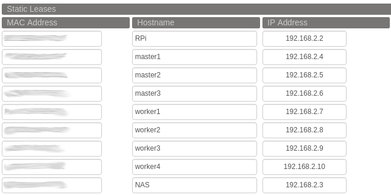

# Setup

Before starting I configured my router to give the static IPs specified in the [Infrastructure](./intro.md#cluster-infrastructure) to each machine. Here is the configuration of my [DD-WRT](https://dd-wrt.com/) router under Services -> Static Leases (the NAS was added at the end).



Then I added some configuration to my laptop's `~/.ssh/config` for ease of management:

```bash
Host m1  # stands for Master 1
  HostName 192.168.2.4
  User root

# Same for other 2 masters

Host w1  # stands for Worker 1
  HostName 192.168.2.7
  User root

# Same for other 3 workers
```

I know there are tools like [Ansible](https://www.ansible.com/) to further automate this part, but they are a bit of an overkill to my cluster's size. I also could have divided master and worker nodes in different subnets. That would simplify small parts of the process but I didn't think about it at the right time.

## Operating System

One thing that I love about Docker is the minimal requirements it has to run both in terms of software and hardware. You can even run docker on [Raspberry Pi](https://www.raspberrypi.org/)'s and the like with a minimal performance hit.

So let's start with the OS. All managers and workers of these adventures will be used exclusively to run Docker, so a minimal and usable OS in which Docker runs without problems would be the reasonable choice.

There are many OS's out there that are designed *exclusively* (cough) to run containerized applications. But in reality they are all rather opinionated and honestly do much more than that. For example, the now discontinued [Container Linux](https://en.wikipedia.org/wiki/Container_Linux) included software packages to manage a potential cluster and coordinate services. In my opinion these tasks should be handled either by the orchestrator or by services running in the cluster, not by the OS. There are other *container oriented* (cough) OS's like [CoreOS](https://cloud.redhat.com/learn/coreos/), [Mesosphere DCOS](https://d2iq.com/products/dcos) or [RancherOS](https://rancher.com/products/rancher/), but they are also rather opinionated and include tools related to things like Kubernetes or Mesos, apart from always suggesting you to manage your cluster with their preferred software. If you don't believe me just look at the size of [Fedora's CoreOS](https://getfedora.org/coreos?stream=stable), which is the basis for some of these projects and is described as a *minimal operating system for running containerized workloads securely and at scale*. The downloaded ISO weights more than 700MB. So much for minimal.

So what's my OS of choice? The great [**❤️Alpine Linux❤️**](https://www.alpinelinux.org/). It is **really** a minimal OS that comes with just enough tools to be functional and fun. Moreover, the [docker package](https://pkgs.alpinelinux.org/package/edge/community/x86_64/docker) is included in the official community repositories. Once installed on your machine, the **entire OS** uses no more than 150MB. It's not as lightweight as [Tiny Core Linux](http://www.tinycorelinux.net/) but it allows us adventurous spirits to do everything we need in a simple way.

> A side comment on Alpine Linux: Since it is so lightweight and useful at the same time, it is many times the OS of choice to build Docker images. People start from Alpine Linux and then install some packages. For example if you want a container that connects to a MariaDB database you can just run `apk add mariadb-client`. Because of this, there is A LOT of software that is regularly updated to the Alpine official repositories.

Installation and configuration was also a breeze. Just to make the point: After everything was connected I had my cluster up and running in under an hour and a half. This includes installing the OS and software, and making the 7 machines form the Swarm cluster. And this was my first time installing Alpine Linux directly to a computer.

Enough words then, let's go with OS installation. I downloaded the latest *STANDARD* version of Alpine Linux [here](https://www.alpinelinux.org/downloads/) and burned it to a bootable USB drive with something like [Balena Etcher](https://www.balena.io/etcher/). I went on and boot each machine into the USB, waited for the OS to be ready and installed Alpine from the command line. For completeness I document everything I did on the Master 1 machine, excluding some of the output for briefty:

```
# After everything loaded correctly

localhost login: root
Welcome to Alpine!

The Alpine Wiki contains a large amount of how-to guides and general
information about administrating Alpine systems.
See <http://wiki.alpinelinux.org/>.

You can setup the system with the command: setup-alpine

You may change this message by editing /etc/motd.
```
So I run the `setup-alpine command`. It first asked for the language
```
localhost:~# setup-alpine
Available keyboard layouts:
af     be     cm     epo    gh     iq     kr     ma     nl     rs     tj
al     bg     cn     es     gr     ir     kz     md     no     ru     tm
am     br     cz     fi     hr     is     la     me     ph     se     tr
ara    brai   de     fo     hu     it     latam  mk     pk     si     tw
at     by     dk     fr     ie     jp     lk     ml     pl     sk     ua
az     ca     dz     gb     il     ke     lt     mt     pt     sy     us
ba     ch     ee     ge     in     kg     lv     ng     ro     th     uz
Select keyboard layout [none]: us
```
and the language variant
```
Select variant []: us-alt-intl
```
then the hostname for the machine
```
Enter system hostname (short form, e.g. 'foo') [localhost]: master1
```
The network interface to initialize and use
```
Which one do you want to initialize? (or '?' or 'done') [eth0]
```
The IP of the machine
```
Ip address for eth0? (or 'dhcp', 'none', '?') [dhcp] 192.168.2.4
```
Further manual network configuration, not sure what happens if you select yes
```
Do you want to do any manual network configuration? (y/n) [no]
```
Now DNS name and DNS server(s). Initially I thought the DNS server would be obtained from the router or point directly to it, so I left `DNS Nameserver(s)` empty. This was not the case and the installation failed. Make sure you enter a valid `DNS Nameserver(s)`. If you don't know what to select there just put your router's IP or `1.1.1.1` ([Cloudflare's](https://www.cloudflare.com/dns/) public DNS server).
```
DNS Domain Name? (e.g. 'bar.com') [] swarmadventures.com
DNS Nameserver(s)? [] 192.168.2.2
```
Then change the root password
```
Changing password for root
New password:
Retype password:
```
Select timezone
```
Which timezone are you in? ('?' for list) [?] Chile/Continental
```
HTTP Proxy, none in my case
```
HTTP/FTP proxy URL? (e.g. 'http://proxy:8080', or 'none') [none]
```
At this point the machine will look for available mirrors to download additional packages. Here is where I got an error originally for not setting the DNS server(s). You have to choose one of the mirrors to install the software from:
```
Enter mirror number (1-75) or URL to add (or r/f/c/done) [f]
```
Install an SSH server
```
Which SSH server? ('openssh', 'dropbear' or 'none') [openssh]
```
Select Network Time Protocol client
```
Which NTP client to run? ('busybox', 'openntpd', 'chrony' or 'none') ['chrony']
```
Then we are presented with the list of available hard drives to install the OS to
```
Which disk(s) would you like to use? (or '?' for help or 'none') [none] sda
```
and how to use that drive
```
How would you like to use it? ('sys', 'data', 'crypt', 'lvm', or '?' for help) [?] sys
```
All data in the drive will be erased, so Alpine asked politely:
```
WARNING: Erase the above disk(s) and continue? (y/n) [n] y
```
After less than 20 seconds, Alpine was installed to the selecte drive. The steps above might look like a lot. But trust me, after a few machines were ready, selecting all the options and the actual installation (2 reboots included) did not take more than 5 minutes per machine.

## Installing Docker

Now that each machine was provisioned with a great OS and an SSH server, I installed Docker. In each machine I did the following:
 1. SSH into the machine and edit `/etc/apk/repositories` to uncomment the line corresponding to the community repos. Afterwards the file looked like this
```
#/media/sda/apks
http://dl-cdn.alpinelinux.org/alpine/v3.15/main
http://dl-cdn.alpinelinux.org/alpine/v3.15/community
#http://dl-cdn.alpinelinux.org/alpine/edge/main
#http://dl-cdn.alpinelinux.org/alpine/edge/community
#http://dl-cdn.alpinelinux.org/alpine/edge/testing
```
 2. Run `apk update` and `apk upgrade` (update package list and upgrade installed packages).
 3. Run `apk add docker` (install docker).
 4. Run `service docker start` (start docker daemon).
 5. Run `rc-update add docker boot` (make the docker daemon start at boot).

And that's it. Every time the machine boots, the Docker daemon will be up and running in no time.

## The swarm cluster

So docker was up and running in each machine. Then I created the sarm by SSH'ing into Master 1 and initializing a swarm, advertising its IP address:
```bash
$ docker swarm init --advertise-addr 192.168.2.4

Swarm initialized: current node (nnnnnnnnnnnnnnnnnnnnnnnnn) is now a manager.

To add a worker to this swarm, run the following command:

    docker swarm join \
    --token XXXXXX-X-XXXXXXXXXXXXXXXXXXXXXXXXXXXXXXXXXXXXXXXX-XXXXXXXXXXXXXXXXXX \
    192.168.2.4:2377

To add a manager to this swarm, run 'docker swarm join-token manager' and follow the instructions.
```
Following the instructions, copied the `docker swarm join` command and run it in each **worker** machine:
```
$ docker swarm join \
  --token XXXXXX-X-XXXXXXXXXXXXXXXXXXXXXXXXXXXXXXXXXXXXXXXX-XXXXXXXXXXXXXXXXXX \
  192.168.2.4:2377

This node joined a swarm as a worker.
```
All workers are part of the swarm now. Back at the master node:
```
$ docker swarm join-token manager

To add a manager to this swarm, run the following command:

    docker swarm join \
    --token YYYYYY-Y-YYYYYYYYYYYYYYYYYYYYYYYYYYYYYYYYYYYYYYYY-YYYYYYYYYYYYYYYYYY \
    192.168.2.4:2377
```
And finally in the other two master nodes:
```
$ docker swarm join \
  --token YYYYYY-Y-YYYYYYYYYYYYYYYYYYYYYYYYYYYYYYYYYYYYYYYY-YYYYYYYYYYYYYYYYYY \
  192.168.2.4:2377
```
That's it. Literally. I could then SSH into any manager node and
```bash
$ docker node ls
ID             HOSTNAME   STATUS    AVAILABILITY   MANAGER STATUS   ENGINE VERSION
ain6qwpump *   master1    ready     active         leader           20.10.11
jsuq67ttyy     master2    ready     active         reachable        20.10.11
ffkjxnfavn     master3    ready     active         reachable        20.10.11
tgu2joclkh     worker1    ready     active                          20.10.11
jnz7jeb2lg     worker2    ready     active                          20.10.11
n8x6hvzv79     worker3    ready     active                          20.10.11
uttuldeovx     worker4    ready     active                          20.10.11
```

The Swarm is now readdy 🚀. Let's prepare it to host applications by provisioning some [central services](./services.md).
